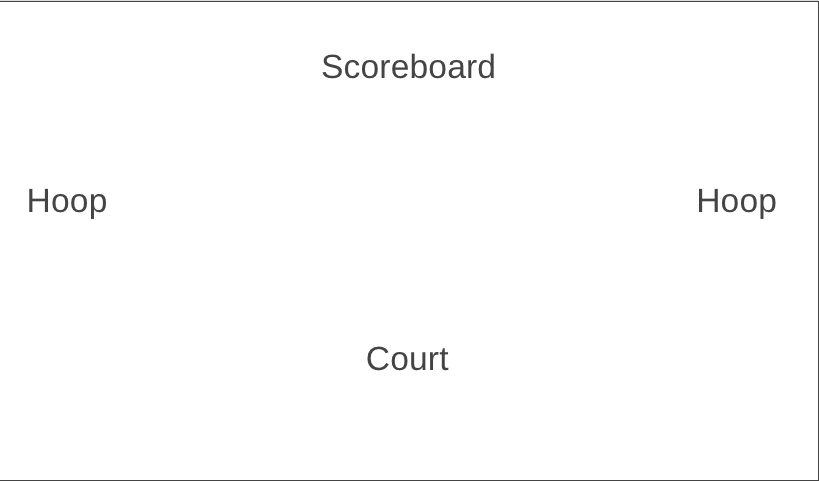

# NBA Jam

A local multiplayer HTML5 Canvas basketball game inspired by NBA Jam. Two players choose characters, run the court, jump, shoot, and try to outscore each other before the clock runs out.

Live site: https://dkdan10.github.io/nbaJam/



## Controls

Player 1:

- Move: Arrow keys
- Jump: Up arrow
- Shoot: `/`

Player 2:

- Move: `A` and `D`
- Jump: `W`
- Shoot: `Q`

## Tech Stack

- HTML5 Canvas
- Vanilla JavaScript
- Vite
- Vitest
- GitHub Pages

## Setup

Install dependencies:

```sh
npm install
```

Start the development server:

```sh
npm run dev
```

Run tests:

```sh
npm test
```

Build for production:

```sh
npm run build
```

Preview the production build:

```sh
npm run preview
```

## Project Structure

- `src/index.js` starts the game once the canvas is available.
- `src/js/game.js` coordinates menu state, gameplay state, and the animation loop.
- `src/js/player.js` and `src/js/player2.js` handle player movement, jumping, possession, and shooting.
- `src/js/ball.js`, `src/js/hoop.js`, `src/js/court.js`, and `src/js/scoreboard.js` contain the core game objects.
- `src/js/menu_screens` contains the main menu and character select screens.

## Deployment

The game is deployed to GitHub Pages with GitHub Actions. Pushes to `master` run tests, build the Vite app, and publish the generated `dist` artifact.
