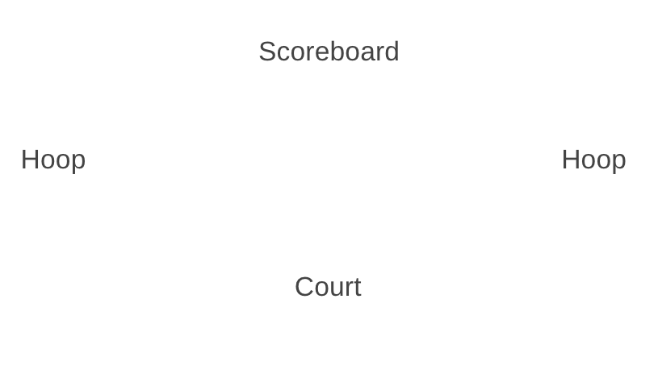

# nbaJam

Link to live site: https://nba-jam-slam.herokuapp.com/

## Background and Overview

Basketball has been a big part of my life and I want to share the joy of playing the game with my users. NBA Jam is a game that extends generational boundaries, and with that in mind, my goal is to bring my users an experience that they would share with thier kids for generations as well. 

NBA Jam is a relatively simple game; One or two players go head to head on the basketball court in a 2 minute game. The player mechanics are to run, jump, steal, and, of course, shoot the basketball into the hoop. This game was inspired by the original NBA Jam.

## Functionality
Controls:
* Users use the arrow keys or WSAD in order to controller thier players.
* Using x or /, a User can get thier player to shoot or steal the ball depending on whether they are on offense or defense. 

Technologies:
* HTML5 Canvas
* Vanilla JavaScript
* Webpack
* Howler.js

Main Files:
* player.js (AIPlayer, HumanPlayer)
* court.js (Renders the court and the hoops)
* ball.js (Holds the balls location)
* hoop.js (Left hoop and right hoop, logic for when a point is scored)
* scoreboard.js (Middle of the screen, has both scores and countdown.)

## MVP Features
* Court to Render and a player to move along the court.
* Implement ball logic, where a player can run with a ball and shoot a ball at the hoop.
* Add score keeping to the game.
* Allow for two players to play the game.
* Add websockets to allow for two players to play against eachother from diffrent computers. 

## Development timeline
Day 1
* Do first MVP

Day 2
* Do second MVP

Day 3
* Clean up first two MVPs work on third MVP.

Day 4
* Do fourth MVP

Day 5
* Do fifth MVP

Bonus
* Get AI player to respond to Human player's input and give a little competition. 

